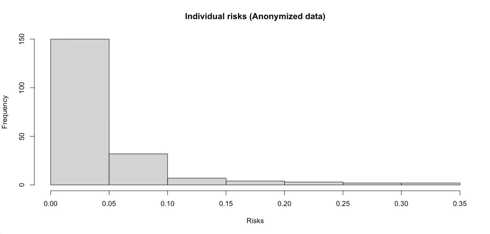

# 	SDC for Voting Survey

###### Edi Begovic (edbe)  ·  Gergo Koncz (geko)  ·  Høgni Jacobsen (hoja) · :q!

### Introduction

We use the sdcMicro web interface to examine the dataset and analyze the relationships between the different variables to determine how much they influence each other. 

We register all variables available in the public register as quasi-identifiers, such that *party* (voted for) is considered the only sensitive variable.

### Methodology

We start out by removing any direct identifiers; this being the names, which further carry no utility for the analysis. To measure risk, we mainly use k-anonymity as a baseline. We also incorporate weights for the quasi-identifiers from the public register and evaluate the global identification risk.

##### Recoding

Apart from *DOB* (*date for birth*), all other key variables are categorical but contain many different values and thus increases uniqueness. We therefore split them into more coarse groups where we don't see a high reduction in utility. 

 *Age* is defined by subtracting the birth-year from 2020 and further grouping them into four intervals. The solution is not the most elegant, but it is essentially the same as using the birth-year grouping criteria.

| Variable                                    | Grouping                                           | k2-anonymity violation |
| :------------------------------------------ | -------------------------------------------------- | ---------------------- |
| Original                                    | -                                                  | 198 · 98%              |
| DOB (*date of birth*) Renamed: **age** | 1 (<31) 2 (31-45) 3 (46-65) 4 (>65) | 55 · 27.5%             |
| Citizenship                                 | Danish Other                                  | 55 · 27.5%             |

*Citizenship* is also recoded, grouping all non-Danish citizenships as they only make up 7.5% of records. While there is no immediate change in k-anonymity, it will reduce the number of suppressions needed in the following step, minimizing loss in utility.

As *educational background* is not considered publicly available, we decided to include it without any modification. This information is however - as with everything else - still susceptible for recognition by the end user. Our decision was based on the notion that it adds one more demographic variable to the dataset, therefore increasing its utility.

##### Suppression

After recoding, we let sdcMicro apply local suppression to achieve 2k-anonymity. We do not specify any importance vector, as very few suppressions are needed.

| Variable    | Number of supressed values | %     |
| :---------- | -------------------------- | ----- |
| Age         | 21                         | 10.5% |
| Zip         | 4                          | 2%    |
| Citizenship | 1                          | 0.5%  |

After suppression we achieve full 2k-anonymity as well as only having 8 individuals (4%) violate 3k-anonymity. Marital status was removed as it had little contribution to the analysis, given how it correlates with age and increases disclosure risk.

##### Perturbation

After suppression we have a very low percentage of individuals violating 3k-anonymity and none violating 2k-anonymity, therefore we decided not to apply any perturbation to the data to keep more utility. We believe that it is still hard to unequivocally identify voters with the help of our anonymized data. Had any perturbation been performed, this would further have to be clearly stated to the end-user of the data, as relationships between variables wouldn't be kept. 

After the above steps, no record has a reidentification risk above 0.33, with more than 90% being less than 0.1. Though the risk is heavily reduced, many keys share the same value for the sensitive variable (they voted for the same party). In fact, 78 records violate 2-diversity for *party*. This can be hard to mitigate, as people of the same demographics also tend to vote the same.

### Assessing Utility

To asses the utility of the modified data, we check the 95% confidence intervals on the proportions of red/green votes for each categorical value.

### Uses for Analysis

For the analytical purposes of the data, we'd argue that, apart from voting type and choice (*evote* and *party*, respectively), age in itself would suffice as argumentation for the skew in how electronic and paper ballots were cast. Keeping *age groups* as the only demographic variable would significantly reduce the identification risk. However, all of the demographic variables are correlated to various degrees and thus we decided to keep most of them. 

With respect to the analytical questions provided, we would approach them the same way with the anonymized data as with the non-anonymized. Below we cover the analytical purposes of the data as mentioned in the project description.

###### A)	

The votes for each party, Green and Red, are summed for each voting method. A statistical test, like the Chi-squared test, can then be performed on the summed values from the survey and the totals from the election results.

###### B)

The votes for each party, Green and Red, are summed for each voting method in the survey data. A statistical method, like the T-test, can then be applied or a more naïve approach can be taken by just comparing the ratio of in person and e-votes.

###### C)

The demographic variables used are *sex*, *zip*, *citizenship* and *education* for the survey dataset. We follow the same steps as in **B**, but further subdivide the voting proportions by demographic variables. A statistical method, like the T-test, can then be applied on the demographic variables against the population proportions (from survey) or a more naïve approach can be taken by simply comparing the ratio of physical and e-votes for the demographic factors against the survey proportions.

### Auxiliary Data

As auxiliary data we decided to shed some light on the citizenship of non-Danish voters. Previously we encoded their citizenship as "Other", whereas in the auxiliary data we create a table of their exact citizenship matched with their age (calculated the disclosed way) and their education level. The file contains 15 lines, and an equipped adversary will with certainty be able to identify 8 voters as follows:

***Spicely, Treyvon***
***Chang,  Phurba***
***Rae, Phillip***
***Mitchell, Silvano***
***Carlos, Caleb***
***Smith, Adjoa***
***Le, Whitney***
***Smith, Haley***

#### Further measures to hide

We could use perturbative methods to hide users more as well, applying PRAM would increase the uncertainty regarding the values.

